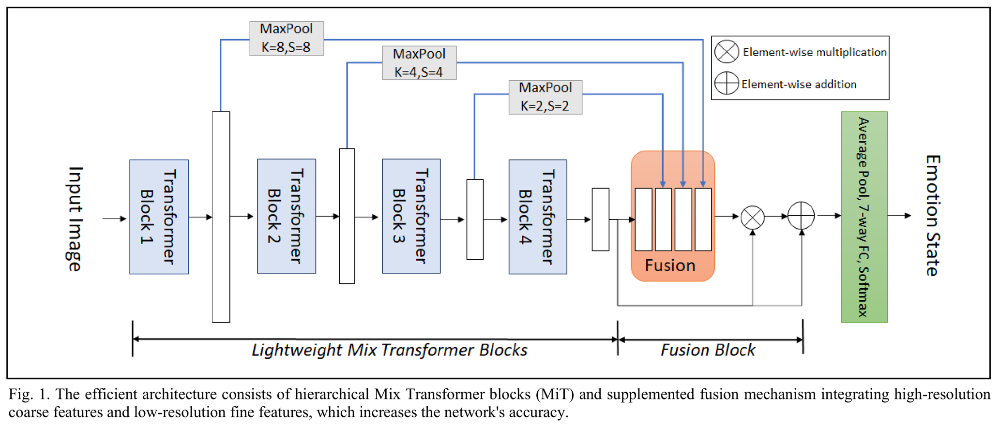
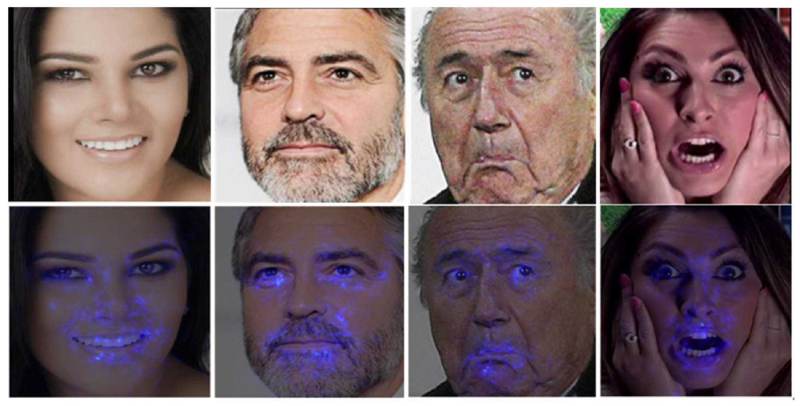
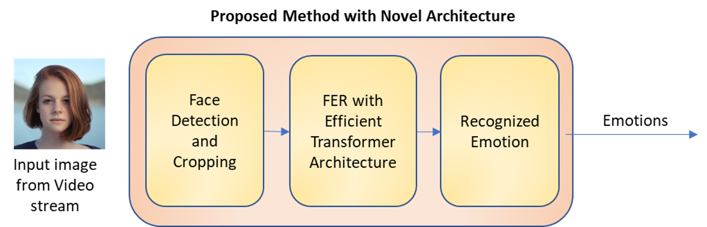
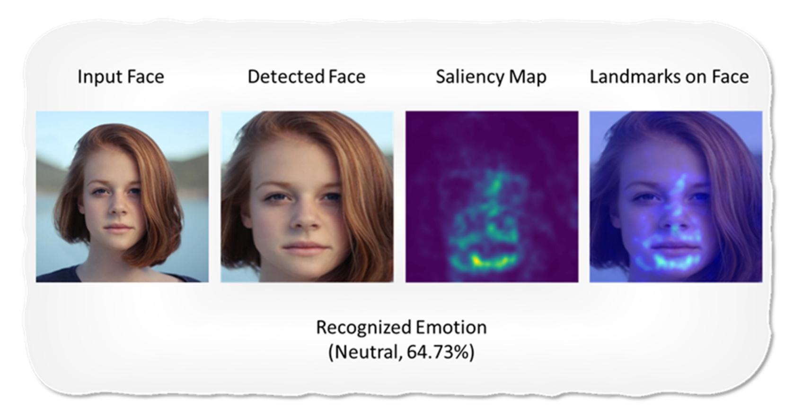

  <a href="https://www.linkedin.com/in/kulin-patel">Presentation</a> |
  <a href="https://github.com/DATA-606-2023-FALL-MONDAY/Patel_Kulin">GitHub Repository</a> |
  <a href="https://www.youtube.com/some-video-link">YouTube Video</a>

<h1 align="center">Develop a Computationally Efficient Transformer-based Architecture for Facial Expression Recognition (FER)</h1>

<h3 align="center"><strong>Author:</strong> Kulin Patel (<a href="https://www.linkedin.com/in/kulin-patel">LinkedIn</a>)</H3>

<h3 align="center"><strong>Prepared for UMBC Data Science Master Degree Capstone 
by Dr. Chaojie (Jay) Wang, Fall 2023</strong></h3>

## 1. Background

Facial Expression Recognition (FER) is pivotal in human-computer interaction and emotional analysis. While Convolutional Neural Networks (CNNs) have shown promise in FER, the emergence of Vision Transformers (ViTs) and traditional Transformers designed for language tasks offers new opportunities for improved accuracy. However, these Transformer architectures are often computationally intensive, limiting their real-world applications.

This project aims to develop a computationally efficient Transformer-based FER architecture, drawing inspiration from both ViTs and traditional Transformers.

The primary objectives of this project are:

* Efficiency: To design a Transformer-based FER architecture that minimizes computational requirements while maintaining competitive accuracy levels.
* Real-time Processing: To enable real-time or near-real-time FER, ensuring the model's suitability for applications such as emotion-aware interfaces and virtual reality.

By addressing these challenges and combining insights from ViTs and Transformers, we can unlock the potential of emotion-aware technology across various domains.

Note: Farshad Safavi (fsafavi1@umbc.edu) and I conducted original research in the Sensorimotor Control Laboratory at UMBC (https://vinjamurilab.cs.umbc.edu) under the guidance of Prof. Ramana Vinjamuri. While our initial research involved extensive training and testing files with disorganized and repetitive code, I have chosen to revisit this project as my capstone for DATA 606. This decision allows me to leverage this work as a platform to demonstrate my mastery of Data Science, acquired during my Master's program.

## 2. Data

**Data Source:** [Challenges in Representation Learning: Facial Expression Recognition Challenge](https://www.kaggle.com/c/challenges-in-representation-learning-facial-expression-recognition-challenge/data)

**Data**:
- Facial images with 7 categories
- Seven categories: Angry, Disgust, Fear, Happy, Sad, Surprise, Neutral

**Data size**: 35887 images

**Data size in MB**: 92.5 MB

**Data format**: 48x48 pixel grayscale images of faces

The data consists of 48x48 pixel grayscale images of faces. The faces have been automatically registered so that the face is more or less centered and occupies about the same amount of space in each image. The task is to categorize each face based on the emotion shown in the facial expression in to one of seven categories

## 3. Experimental Setup
The training images are resized to 224 × 224 and transformed to the RGB format to match the requirements of pre-trained models in ImageNet. Data augmentation techniques are employed during training to prevent overfitting. These techniques encompass left-right flipping and rotation within the range of [-30, 30] degrees. Each experiment is conducted for a maximum of 50 epochs and will terminate if the validation accuracy does not improve for more than eight consecutive steps. A batch size of 48 is employed with an initial learning rate of 0.0001, which is reduced by a factor of ten if the validation accuracy does not improve for two consecutive epochs. The momentum is set to 0.9 and weight decay to 0.001. We train all models on a single system with NVIDIA GeForce RTX 3090 GPU with an Intel Core i9 processor. Experiments using different networks are conducted under the same
settings.

## 4. Efficient Deep Learning Architecture:

  

## 5. Landmarks for Explainability:

In the context of deep learning models, explaining the decisions made by the model can often be challenging. However, in our case, we have implemented landmark detection as a means to enhance model interpretability.

The images below illustrate the landmarks detected by our model. These landmarks are determined using a saliency map generated from the model's weights. The pixels highlighted in blue signify the areas of significance that contribute to the model's decision-making process.

  

## 6. End-to-End Pipeline:

When implemented for real-time video in Facial Expression Recognition (FER), our system operates as follows:

1. The face detection model first identifies the face within the video frame.

2. Once the face is detected, it is cropped to pass through our efficient transformer-based emotion recognition model.

3. The emotion recognition model, which employs an efficient transformer architecture, then predicts the probability of each of the seven different emotions for the detected face.

4. Among these probabilities, the emotion with the highest likelihood is selected as the predicted emotion. 

  

### Example:

  

## 7. Performance evaluation of networks on FER2013

| Model Names     | Flops  | Parameters | Time   | Accuracy |
|:---------------:|:------:|:----------:|:------:|:--------:|
| ResAttNet56     | 6.33B  | 29.77M     | 17.69ns| 72.63%   |
| Densenet121     | 2.89B  | 6.96M      | 19.57ns| 73.16%   |
| Resnet152       | 11.60B | 58.16M     | 23.66ns| 73.22%   |
| Cbam_resnet50   | 4.14B  | 26.05M     | 16.94ns| 73.39%   |
| ResMaskingNet   | 26.76B | 142.9M     | 17.63ns| 74.14%   |
| **Proposed Method** | **4.25M**  | **3.45M**      | **7.74ns** | **73.47%**   |

As shown in above comparision, among the evaluated models, our proposed model shows the lowest floating-point operations (Flops) indicating efficient utilization of transformer blocks through a compact hierarchical architecture, an efficient self-attention mechanism, and the exclusion of positional embeddings from the original vision transformer structure.

Similarly, our deep network excels the efficiency in terms of the number of learnable parameters, with only 3.45 million parameters. This is significantly lower than other methods, for instance, the number of learnable parameters in our model is 41 times lower than that of ResMaskingNet. By employing a compact model with fewer parameters, our proposed method reduces memory requirements and computational overhead.

Furthermore, our model demonstrates very high-speed in terms of inference time. With an average inference time of 7.74 nanoseconds(ns), it outperforms other methods. This indicates that our method achieves fast and responsive predictions, making it suitable for real-time applications.

In addition to its efficiency, our method also achieves a high accuracy of 73.47%, which is the second-best result obtained in the evaluation table. The higher accuracy can be attributed to the fact that the hierarchical Transformer Blocks possesses a larger effective receptive field (ERF) compared to traditional CNN layers. Furthermore, the higher accuracy can be attributed to the incorporation of a self-attention mechanism and the fusion of coarse features and fine features.

This table demonstrates that our method strikes a balance between efficiency and accuracy, outperforming other methods in terms of efficiency metrics without compromising on classification performance.

Overall, proposed model stands out as the most efficient option among the evaluated methods in terms of Flops, number of learnable parameters and inference time.  It combines low computational complexity, a compact learnable parameter, and fast inference time while maintaining competitive accuracy on the FER2013 dataset.

## 8. Conclusion:

Our work introduces a novel efficient deep learning model for facial expression recognition (FER) using a modified transformer hierarchy and a supplemented fusion block. The model incorporates a self-attention mechanism to enhance attention at the pixel-level landmark segments. In addition, the fusion block combines high-resolution coarse features with low-resolution fine features to achieve
improved accuracy. Experimental results demonstrate that the proposed method achieves high efficiency through low computational complexity, fewer learnable parameters, and low latency while maintaining competitive accuracy on the FER2013 dataset. Future work involves evaluating the model's eneralization on other datasets and exploring different novel approaches to enhance accuracy further.

## 9. Paper Publication:
- Our paper has been accepted by IEEE BSN'23 and is now available online. You can access it through this link: https://ieeexplore.ieee.org/document/10331041.

- Additionally, I had the opportunity to present our paper at the MIT Media Lab in Cambridge.

## 10. References:

1. T. Ojala, M. Pietikainen, and T. Maenpaa, “Multiresolution grayscale and rotation invariant texture classification with local binary patterns,” IEEE Trans. Pattern Anal. Mach. Intell., vol. 24, no. 7, pp. 971–987, 2002, doi: 10.1109/TPAMI.2002.1017623.
2. D. G. Lowe, “Distinctive Image Features from Scale-Invariant Keypoints,” Int. J. Comput. Vis., vol. 60, no. 2, pp. 91–110, 2004, doi: 10.1023/B:VISI.0000029664.99615.94.
3. L. Pham, T. H. Vu, and T. A. Tran, “Facial Expression Recognition Using Residual Masking Network,” in 2020 25th International Conference on Pattern Recognition (ICPR), 2021, pp. 4513–4519. doi: 10.1109/ICPR48806.2021.9411919.
4. R. Pecoraro, V. Basile, V. Bono, and S. Gallo, “Local Multi-Head Channel Self-Attention for Facial Expression Recognition,” CoRR, vol. abs/2111.0, https://arxiv.org/abs/2111.07224
5. F. Safavi and M. Rahnemoonfar, “Comparative Study of RealTime Semantic Segmentation Networks in Aerial Images During Flooding Events,” IEEE J. Sel. Top. Appl. Earth Obs. Remote Sens.. vol. 16, pp. 15–31, 2023, doi: 10.1109/JSTARS.2022.3219724.
6. F. Safavi, T. Chowdhury, and M. Rahnemoonfar, “Comparative Study Between Real-Time and Non-Real-Time Segmentation Models on Flooding Events,” in 2021 IEEE International Conference on Big Data (Big Data), 2021, pp. 4199–4207. doi: 10.1109/BigData52589.2021.9671314
7. E. Xie, W. Wang, Z. Yu, A. Anandkumar, J. M. Alvarez, and P. Luo, “SegFormer: Simple and Efficient Design for Semantic Segmentation with Transformers,” in Advances in Neural Information Processing Systems, 2021, vol. 34, pp. 12077–12090. [Online].Available: https://proceedings.neurips.cc/paper_files/paper/2021/file/64f1f27bf1b4ec22924fd0acb550c235-Paper.pdf
8. I. J. Goodfellow et al., “Challenges in Representation Learning: A Report on Three Machine Learning Contests,” in Neural Information Processing, 2013, pp. 117–124.
9. K. He, X. Zhang, S. Ren, and J. Sun, “Deep Residual Learning for Image Recognition,” in 2016 IEEE Conference on Computer Vision and Pattern Recognition (CVPR), 2016, pp. 770–778. doi: 10.1109/CVPR.2016.90.
10. G. Huang, Z. Liu, L. Van Der Maaten, and K. Q. Weinberger, “Densely Connected Convolutional Networks,” in 2017 IEEE Conference on Computer Vision and Pattern Recognition (CVPR), 2017, pp. 2261–2269. doi: 10.1109/CVPR.2017.243.
11. F. Wang et al., “Residual Attention Network for Image Classification,” CoRR, vol. abs/1704.0, 2017, [Online]. Available: http://arxiv.org/abs/1704.06904
13. S. Woo, J. Park, J.-Y. Lee, and I.-S. Kweon, “CBAM: Convolutional Block Attention Module,” in European Conference on Computer Vision, 2018.
